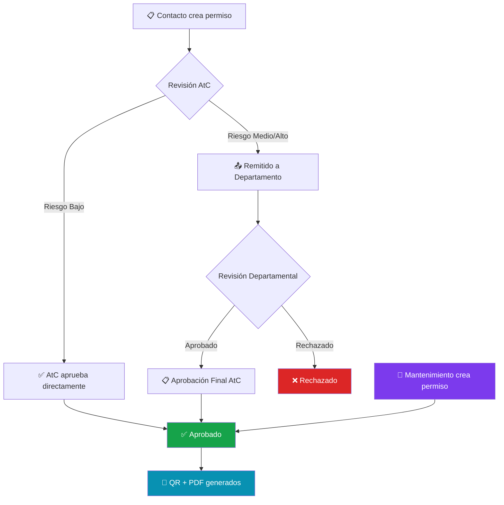

# Flujo General de Aprobación

Los permisos de trabajo pasan por un proceso de aprobación que varía según la **clasificación de riesgo** que asigne Atención al Cliente durante la revisión.

## Diagrama general



---

## Flujo para permisos de **Contacto** (Locatario)

### Riesgo Bajo — Aprobación directa

```
Contacto crea permiso → AtC revisa y clasifica como BAJO → AtC aprueba → ✅ Aprobado
```

1. El **Contacto** crea y envía el permiso
2. **Atención al Cliente** revisa la información
3. AtC asigna la **actividad** del catálogo y clasifica como **riesgo bajo**
4. AtC **aprueba directamente** el permiso
5. Se genera el QR y PDF, se notifica al solicitante

### Riesgo Medio o Alto — Con revisión departamental

```
Contacto crea permiso → AtC revisa y clasifica como MEDIO/ALTO → Remite a departamento → Depto. aprueba → AtC da visto bueno final → ✅ Aprobado
```

1. El **Contacto** crea y envía el permiso
2. **Atención al Cliente** revisa la información
3. AtC asigna la **actividad**, clasifica el **riesgo** (medio/alto) y selecciona el **departamento** técnico
4. AtC **remite** el permiso al departamento (Mantenimiento, Operaciones o Seguridad)
5. El **departamento técnico** realiza la revisión técnica y aprueba
6. El permiso regresa a **Atención al Cliente** para **aprobación final**
7. AtC da el visto bueno final
8. Se genera el QR y PDF, se notifica al solicitante

---

## Flujo para permisos de **Mantenimiento** — Aprobación automática

```
Mantenimiento crea permiso → ✅ Aprobado automáticamente
```

Los permisos creados por usuarios con rol **Mantenimiento** se aprueban de inmediato sin revisión. El QR y PDF se generan al momento de crear el permiso.

---

## ¿Quién decide el departamento revisor?

| Decisión | Responsable |
|---|---|
| Clasificación de riesgo | **Atención al Cliente** (manual) |
| Actividad del catálogo | **Atención al Cliente** (selecciona durante revisión) |
| Departamento técnico | **Atención al Cliente** (selecciona al remitir: Mantenimiento, Operaciones o Seguridad) |

<Callout kind="info">
**Decisión manual**

A diferencia de otros sistemas, la clasificación de riesgo y la asignación de departamento **no son automáticas**. Atención al Cliente evalúa cada permiso individualmente y toma estas decisiones durante la revisión.

</Callout>
## Tiempos del proceso

- **Revisión inicial:** Atención al Cliente revisa los permisos pendientes en orden de llegada
- **Revisión departamental:** El departamento técnico puede aprobar o rechazar con observaciones
- **Aprobación final:** Una vez aprobado por el departamento, Atención al Cliente da el visto bueno final

<Callout kind="alert">
**Tiempos de respuesta**

Se recomienda enviar el permiso con al menos **24 horas de anticipación** para garantizar que pase por todo el proceso de aprobación antes de la fecha del trabajo.

</Callout>
## ¿Qué pasa si rechazan mi permiso?

Si tu permiso es rechazado en cualquier etapa:

1. Recibirás una **notificación** con el motivo del rechazo (mínimo 10 caracteres de observaciones)
2. Podrás ver las **observaciones** en los detalles del permiso
3. Deberás crear un **nuevo permiso** corrigiendo los puntos señalados
