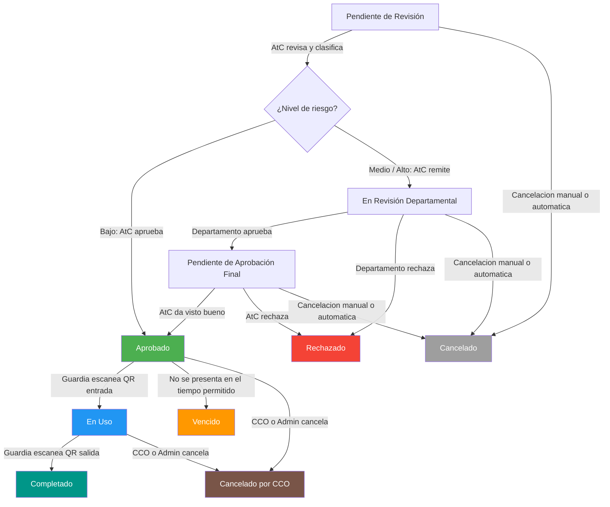

# Estados del Permiso

Cada permiso de trabajo pasa por diferentes estados durante su ciclo de vida.

## Resumen rápido

| Estado | Significado |
|---|---|
| Pendiente de Revisión | Esperando revisión de AtC |
| En Revisión Departamental | Departamento técnico revisando |
| Pendiente Aprobación Final | Esperando visto bueno de AtC |
| Aprobado | QR y PDF generados, listo para usar |
| En Uso | Personal ingresó, trabajo en curso |
| Completado | Salida registrada, trabajo terminado |
| Rechazado | Rechazado con observaciones |
| Vencido | No se presentó a tiempo |
| Cancelado | Cancelado por el solicitante, administrador o por automatizacion |
| Cancelado por CCO | Cancelado por CCO/Admin |

## Diagrama del flujo de estados

<Callout kind="tip">
**Permisos de Mantenimiento**

Los permisos creados por el departamento de Mantenimiento saltan directamente al estado **Aprobado** (se auto-aprueban).

</Callout>
## Descripción de cada estado

### Pendiente de Revisión

El permiso fue enviado y está esperando que **Atención al Cliente** lo revise, clasifique el riesgo y asigne una actividad del catálogo.

- **¿Quién lo ve?** Atención al Cliente y Administrador
- **¿Qué puede hacer el solicitante?** Esperar o cancelar el permiso

---

### En Revisión Departamental

Atencion al Cliente clasifico el permiso como riesgo **medio** o **alto** y lo remitio al departamento tecnico correspondiente. Este estado tambien se usa para flujos directos como **Pabellon M** o **Sistemas Especiales**.

- **¿Quién lo ve?** El departamento asignado y Administrador
- **¿Qué puede hacer el solicitante?** Esperar o cancelar el permiso

---

### Pendiente de Aprobación Final

El departamento técnico aprobó el permiso desde su perspectiva. Ahora Atención al Cliente debe dar el **visto bueno final**.

- **¿Quién lo ve?** Atención al Cliente y Administrador
- **¿Qué puede hacer el solicitante?** Esperar o cancelar el permiso

---

### Aprobado

El permiso fue **aprobado**. Se genero automaticamente el **codigo QR** y el **PDF** del permiso.

- **¿Quién lo ve?** Todos los involucrados
- **¿Qué recibe el solicitante?** Notificacion por sistema, email y/o WhatsApp con enlace para descargar el PDF
- **Siguiente paso:** Presentarse con el QR el día del trabajo

<Callout kind="tip">
**Permiso aprobado**

Cuando tu permiso es aprobado, recibirás notificaciones con el enlace para descargar el PDF. El enlace funciona sin necesidad de iniciar sesión.

</Callout>
---

### En Uso

El guardia escaneó el código QR y registró la **entrada** del personal. El trabajo está en curso.

- **Visible en:** Dashboard del CCO en tiempo real
- **¿Qué significa?** El personal ya ingresó y está trabajando
- **¿Quién puede cancelar?** Solo CCO o Administrador

---

### Completado

El guardia escaneó el código QR para registrar la **salida**. El trabajo terminó exitosamente.

- **Estado final** — No requiere más acciones

---

### Rechazado

El permiso fue rechazado durante alguna etapa de revisión (por Atención al Cliente o por el departamento técnico). Se incluye el motivo del rechazo con un mínimo de 10 caracteres de observaciones.

- **¿Qué puede hacer el solicitante?** Crear un nuevo permiso corrigiendo las observaciones

---

### Vencido

El permiso fue aprobado pero el personal **no se presento** dentro del tiempo establecido, o la fecha de salida ya expiro sin uso valido.

- **Operacion:** El sistema puede marcarlo automaticamente como vencido por no uso
- **Excepcion operativa:** Si la configuracion de entrada tardia lo permite y la fecha de salida aun no pasa, el guardia puede reactivarlo y registrar el acceso
- **Proceso automático:** El sistema vence permisos no usados automáticamente
- **También vence si:** La fecha/hora de salida ya pasó
- **¿Qué puede hacer el solicitante?** Crear un nuevo permiso

---

### Cancelado

El permiso fue cancelado antes de entrar en uso.

- **El solicitante puede cancelar en:** Cualquier estado previo a "En Uso"
- **Requiere:** Motivo de cancelación (mínimo 10 caracteres)
- **Tambien aplica a cancelacion automatica:** Si la hora de entrada expira y el permiso sigue pendiente de aprobacion, el sistema lo cancela automaticamente

<Callout kind="info">
**Cancelacion automatica**

Los permisos que permanecen en etapas pendientes de aprobacion y cuya hora de entrada ya expiro dentro de la tolerancia configurada se cancelan automaticamente.

</Callout>
---

### Cancelado por CCO

El permiso fue cancelado por el **CCO** (Centro de Control Operacional) o un **Administrador**. Este es un estado separado del cancelado normal.

- **¿Quién puede?** Solo CCO y Administrador
- **¿En qué estados?** Permisos en estado "Aprobado" o "En Uso"
- **Requiere:** Motivo de cancelación (mínimo 10 caracteres)
